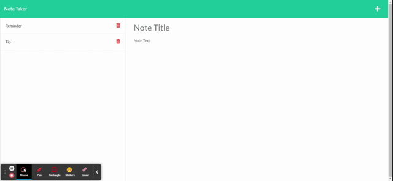

# note-taker
  [](https://opensource.org/licenses/MIT)

[Deployed applicaton](https://note-taker-by-jono.herokuapp.com/notes)

## Description

A simple note taker app powered by ExpressJS. You can save notes with a title and plain text, great for making reminders or writing down things you need to remember!

## Table of contents

- [Installation](#installation)
- [Usage](#usage)
- [Credits](#credits)
- [License](#license)
- [Contribute](#Contribute)
- [Tests](#Tests)
- [Questions](#Questions)

## Installation Instructions

```
npm i
```

## Usage Information:

See deployed link above.

## Demo



## License

This project is available under the MIT license. Visit [License: MIT](https://opensource.org/licenses/MIT) for full license text

## Contribute

Fork or Pull Request

## Tests

N/A

### Questions

Contact me on Github or email.

Github profile: https://github.com/jcarait

Email: jonocdev@gmail.com